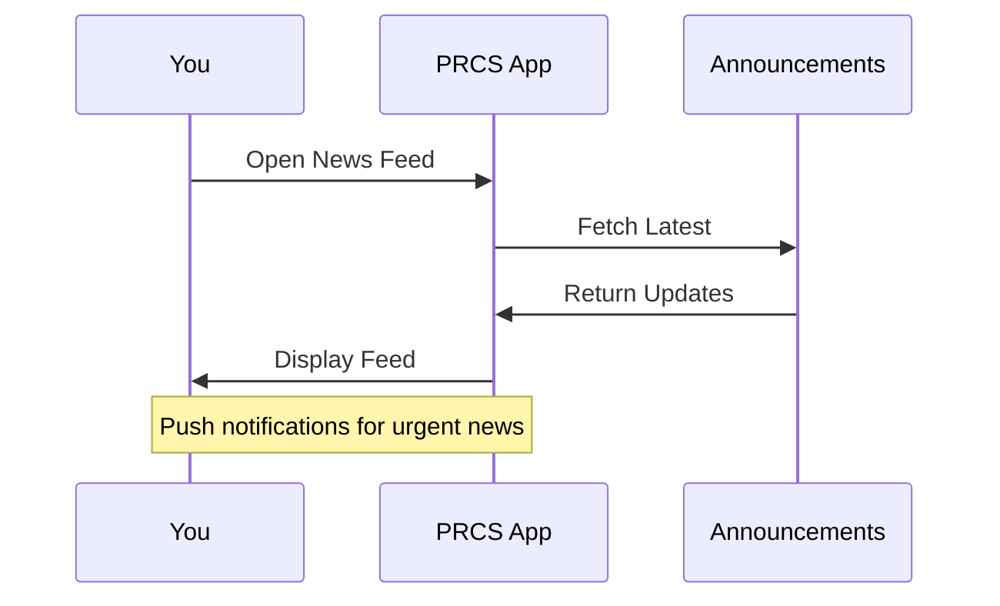

## Overview

PRCS delivers essential employee services through a secure platform. You access resources, submit requests, stay updated on company news, and customize your profile. These features streamline your daily workflow and improve productivity.

<Columns cols={2}>
  <Card title="Resource Library" icon="book-open" href="#resource-library">
    Browse documents, guides, and training materials tailored for your role.
  </Card>
  <Card title="Service Requests" icon="file-text" href="#service-requests">
    Submit and track requests for IT support, HR services, and more.
  </Card>
  <Card title="Company News" icon="bell" href="#company-news">
    Receive real-time updates on announcements, policies, and events.
  </Card>
  <Card title="Profile Customization" icon="user" href="#profile-customization">
    Personalize your dashboard and preferences.
  </Card>
</Columns>

## Resource Library Access

Access the resource library to find company documents and training materials.

<Steps>
  <Step title="Navigate to Library" icon="search">
    Click the `Library` tab in the main navigation menu.
  </Step>
  <Step title="Search Resources" icon="filter">
    Enter keywords or browse by category like `HR Policies` or `Training`.
  </Step>
  <Step title="Download or View" icon="download">
    Select a resource and choose `View` or `Download PDF`.
  </Step>
</Steps>

<Callout kind="tip">
  Use advanced filters for role-specific content, such as `Engineering` or `Sales`.
</Callout>

## Service Request Submission

Submit service requests via the web interface or API. Track status in real time.

<Tabs>
  <Tab title="Web UI" icon="globe">
    Go to `Services > New Request`, fill the form, and submit.
  </Tab>
  <Tab title="API" icon="code">
    Use the API endpoint to automate submissions.

    <ParamField path="serviceId" param-type="string" required="true">
      Unique service identifier, e.g., `it-support`.
    </ParamField>

    <ParamField body="description" param-type="string" required="true">
      Detailed request description.
    </ParamField>

    <Request tabs="JavaScript,cURL">
      ````javascript
      const response = await fetch('https://api.example.com/prcs/requests', {
        method: 'POST',
        headers: { 'Authorization': 'Bearer YOUR_TOKEN', 'Content-Type': 'application/json' },
        body: JSON.stringify({
          serviceId: 'it-support',
          description: 'Laptop screen issue'
        })
      });
      ````

      ````bash
      curl -X POST https://api.example.com/prcs/requests \
        -H "Authorization: Bearer YOUR_TOKEN" \
        -H "Content-Type: application/json" \
        -d '{"serviceId": "it-support", "description": "Laptop screen issue"}'
      ````
    </Request>

    <Response tabs="201,400">
      ````json
      {
        "id": "req_abc123",
        "status": "submitted",
        "submittedAt": "2024-10-15T10:30:00Z"
      }
      ````

      ````json
      {
        "error": "Invalid serviceId"
      }
      ````
    </Response>
  </Tab>
</Tabs>

## Company News and Updates

Stay informed with push notifications and a dedicated news feed. View articles on policy changes, events, and achievements.

Enable notifications in your profile to receive updates instantly. The feed supports filtering by department.



## Profile Customization Options

Tailor your experience with these settings.

<ExpandableGroup>
  <Expandable title="Dashboard Layout" default-open="true">
    Drag and drop widgets like `News`, `Requests`, and `Library` to prioritize content.
  </Expandable>
  <Expandable title="Notification Preferences">
    Select channels: email, in-app, or mobile push for different event types.
  </Expandable>
  <Expandable title="Theme and Language">
    Choose light/dark mode and set language preferences.
  </Expandable>
</ExpandableGroup>

<Callout kind="success">
  Customize your profile to match your workflow. Explore [Quickstart](/quickstart) for initial setup.
</Callout>