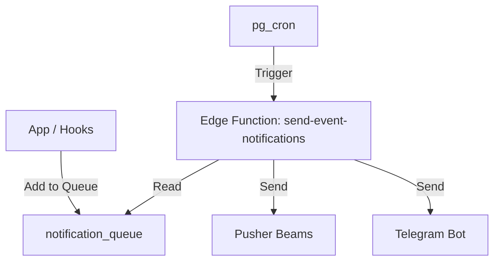

## Overview

The notification system delivers alerts via:

1. **Pusher Beams**: Push notifications to web/mobile.

2. **Telegram**: Chat messages via a bot.

3. **Email**: Notifications via PHP script (client-side fallback).

Additionally, the app shows **in-app** informational alerts (non-push) directly in the UI, e.g. on the Dashboard.

## Architecture



## Components

### 1. Notification Queue

Table: `notification_queue`

- Stores pending notifications.

- Avoids direct triggers sending external requests (reliability).

### 2. Edge Function (`send-event-notifications`)

- Processes the queue in batches.

- Handlers for: `booking`, `appointment`, `event`, `celebration`.

- Updates status to `sent` or `failed`.

### 3. Telegram Integration

- **Bot**: users interact with `@prcs_corp_bot` for notifications and settings.

- **Account linking options**:

  - **Mini App (рекомендуется)**:

    1. Открыть Mini App из бота (inline‑кнопка «🚀 Открыть Mini App» или Mini App в меню бота).

    2. В Mini App залогиниться/зарегистрироваться по корпоративному email.

    3. Telegram аккаунт автоматически привяжется к Supabase‑пользователю через `telegram-link-from-miniapp`.

  - **Код верификации (старый способ, fallback)**:

    1. В боте отправить `/link`, получить одноразовый код.

    2. В веб‑приложении зайти в Profile → Telegram.

    3. Ввести код верификации для привязки.

- **Settings**: Users configure preferences in Profile → Telegram Settings.

  - `bookings_enabled`

  - `appointments_enabled`

  - `events_enabled`

  - `vacation_enabled`

  - `admin_notifications_enabled`

### 4. Email Integration (Client-side)

- **Script**: `public/send-email.php` handles simple email sending via PHP `mail()`.

- **Service**: `src/services/emailService.ts` provides the client-side interface.

- **Usage**: Integrated into `sendSmartNotification` as a fallback channel if Push/Telegram fails, or as an additional channel if configured.

- **Settings**: Checks `email_notifications_enabled` in `profiles` table.

### 5. In-app alerts (Dashboard)

- **Profile completeness reminder**: On `/dashboard`, if the current user's `profiles.birth_date` or `profiles.start_date` is missing, the app shows a dismissible banner prompting the user to complete the profile.

- The banner can be closed for the current visit, but it appears again on each new entry to the Dashboard route.

## User Preferences

Managed in `telegram_notification_settings` table.
The Edge Function checks these settings before sending a Telegram message.

## Development

### Adding a Notification

Use `src/utils/notificationQueue.ts`:

```typescript
await addNotificationToQueue({
  entity_id: booking.id,
  entity_type: 'booking',
  user_id: user.id,
  notification_type: 'booking_created',
  notification_data: { ... }
});
```

### Deployment

Deploy the Edge Function:

```bash
pnpm supabase functions deploy send-event-notifications
```

## Troubleshooting

- **No Telegram message?**

  - Check `telegram_notification_settings`.

  - Ensure `telegram_user_id` is present in `profiles`.

  - Check Edge Function logs.

- **Queue stuck?**

  - Check cron job status.

  - Run `scripts/test-notifications.ps1` to force processing.

